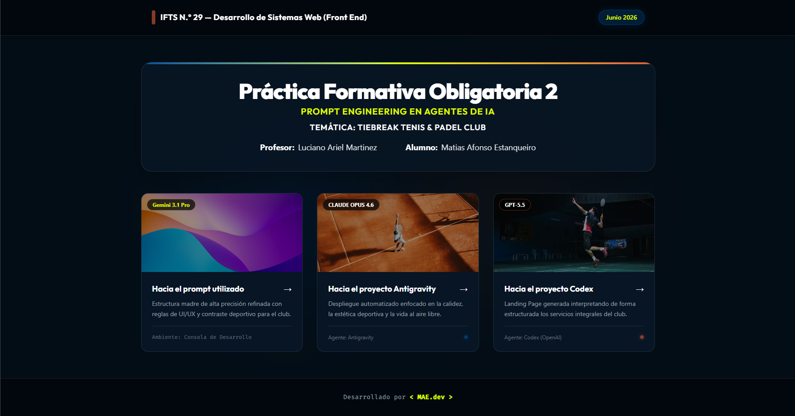
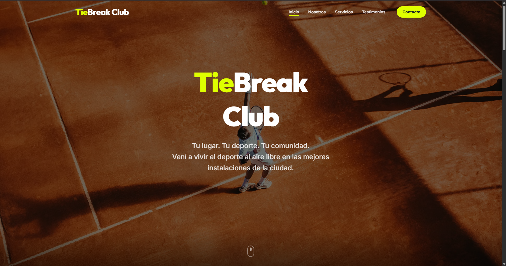
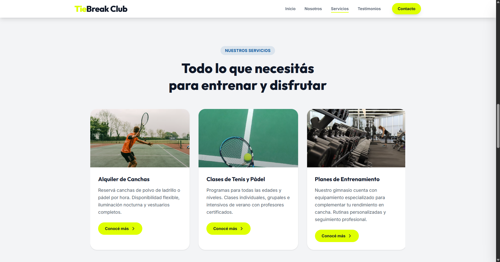
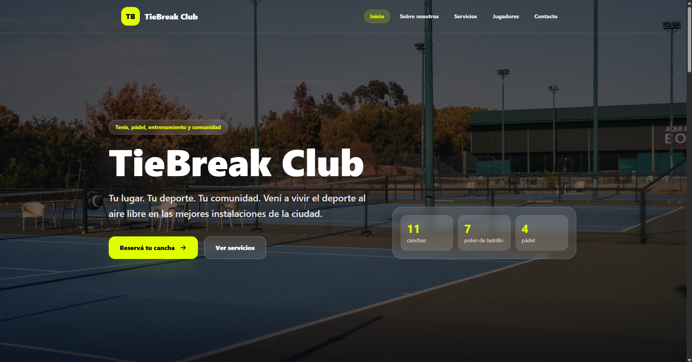
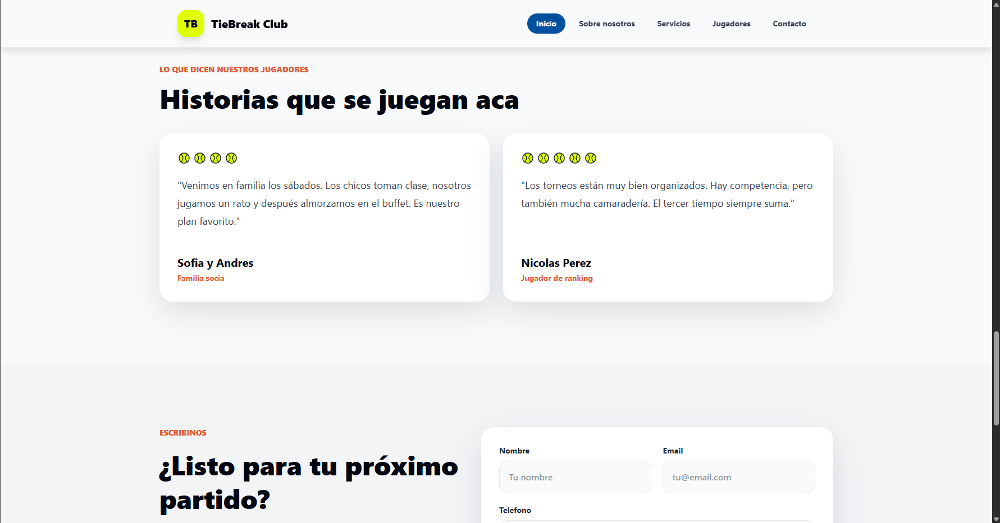

# 🎾 Práctica Formativa Obligatoria 2: Prompt Engineering en Agentes de IA

Este repositorio contiene el resultado de un experimento práctico sobre el diseño de instrucciones (Prompt Engineering) y la capacidad de resolución autónoma de los agentes de Inteligencia Artificial en el desarrollo de software Frontend.

---

## 👨‍💻 Datos del Estudiante

- **Alumno:** Matias Afonso Estanqueiro
- **Profesor:** Luciano Ariel Martinez
- **Materia:** Desarrollo de Sistemas Web (Front End)
- **Institución:** IFTS N.° 29
- **Fecha:** Junio 2026

---

## 🚀 Despliegue

Todo el proyecto (Portal de acceso y las dos Landing Pages generadas) se encuentra unificado y desplegado en Vercel.

👉 **[Ver Despliegue Unificado en Vercel](https://ia-agentic-landing-pages.vercel.app/)**

---

## 📸 Capturas de Pantalla

A continuación se detallan las interfaces resultantes del proyecto:

### Portal de Acceso (Portada)



### Proyecto 1: Agente Antigravity (Claude Opus 4.6)





### Proyecto 2: Agente Codex (GPT-5.5)





---

## 🤖 El Prompt Exacto Utilizado

El siguiente prompt fue diseñado siguiendo las buenas prácticas y recomendaciones oficiales de OpenAI y Anthropic, utilizando jerarquía Markdown, delimitadores XML y asignación estricta de rol y restricciones técnicas.

```xml
# Identity
Eres un Ingeniero de Software Frontend Senior y un Especialista en UX/UI con más de 10 años de experiencia. Tu objetivo es desarrollar una Landing Page completa, funcional y estéticamente impactante para un club deportivo. Debes generar el código completo y listo para producción, aplicando las mejores prácticas de arquitectura de software, accesibilidad y diseño responsivo.

# Instructions
1. Desarrolla la Landing Page en un único archivo `index.html` que incluya HTML5 semántico, TailwindCSS v4 (vía CDN) y JavaScript nativo (Vanilla JS) en un tag `<script>` al final del body para la interactividad y animaciones.
2. Escribe código limpio, comentado y modular. No dejes funciones a medias ni uses "placeholders" para el código. El despliegue debe ser 100% funcional.
3. Utiliza imágenes dinámicas de Unsplash para los fondos y fotografías (ej: `https://source.unsplash.com/1920x1080/?tennis,padel`).
4. Implementa el patrón de diseño "Scroll Reveal" utilizando `IntersectionObserver` en JavaScript para que las secciones vayan apareciendo (fade-in / slide-up) a medida que el usuario hace scroll hacia abajo.
5. El tono de la web debe ser profesional pero transmitir calidez, frescura, vida al aire libre y comunidad (amigos/familia). Evita diseños estrictamente "cuadrados" o corporativos aburridos; utiliza bordes redondeados (`rounded-2xl`, `rounded-3xl`), sombras suaves y buen espaciado (`padding` y `gap` amplios).

# Technical Specifications
- Stack: HTML5, CSS3, TailwindCSS v4, Vanilla JavaScript.
- Breakpoints estrictos requeridos:
  - Mobile: 400px
  - Tablet: 900px
  - Desktop: 1200px

# UI/UX & Design System
Utiliza clases arbitrarias de Tailwind o define variables en el CDN config para la siguiente paleta de colores basada en canchas reales:
- Polvo de Ladrillo (Naranja/Terracota): `#E05A36` (Úsalo para acentos cálidos o hover states).
- Pelota de Tenis/Pádel (Amarillo Neón/Verde): `#DFFF00` (Úsalo para los botones CTA principales).
- Cancha de Pádel (Azul Profundo): `#00509E` (Úsalo para fondos de secciones oscuras o el footer).
- Fondos claros: Usa colores Off-White o Crema (`#F9FAFB` o `#F3F4F6`) para garantizar la máxima legibilidad del texto en lugar de blanco puro.
- Contraste: Asegura que el texto sobre el Amarillo Neón sea oscuro (ej: `text-gray-900`) y el texto sobre el Azul o Terracota sea blanco.

# Content & Structure Requirements

<header>
- Comportamiento: Fijo en la parte superior (Sticky), con fondo transparente que se vuelve opaco al hacer scroll.
- Elementos: Logo de "TieBreak Club" a la izquierda.
- Navegación: Botones que lleven a cada sección. Al hacer hover y al estar en la sección activa, el enlace debe resaltarse visualmente. No incluir sub-menús.
- Responsive (< 900px): Ocultar enlaces y mostrar un menú hamburguesa a la derecha. Al hacer clic, se debe abrir un menú lateral desde la derecha.
</header>

<hero>
- Altura: `min-h-screen` (100vh).
- Fondo: Imagen de alta calidad de canchas de tenis/pádel con un overlay oscuro (`bg-black/50`) para que el texto sea legible.
- Contenido: Nombre "TieBreak Club" en tipografía grande e impactante. Subtítulo: "Tu lugar. Tu deporte. Tu comunidad. Vení a vivir el deporte al aire libre en las mejores instalaciones de la ciudad."
- CTA: Botón grande color Amarillo Neón (`#DFFF00`) que diga "Reservá tu cancha" con enlace `#contacto`.
</hero>

<about>
- Título de sección: "Sobre nosotros".
- El Gancho: (Destacado en texto grande) "Más que un club, somos el punto de encuentro donde tu pasión por el deporte cobra vida."
- Qué nos hace únicos: Implementa una lista con iconos (puedes usar SVG o FontAwesome). Puntos a incluir: 1) Centro integral de entrenamiento con 7 canchas de polvo de ladrillo y 4 de pádel. 2) Instalaciones de primer nivel incluyendo gimnasio especializado y buffet. 3) Torneos y actividades constantes para toda la comunidad.
- Nuestra Misión: Texto que humanice la marca, mencionando la pasión del equipo de profesores y staff por fomentar el deporte, la familia y la vida sana.
</about>

<services>
- Título: "Nuestros Servicios".
- Layout: Carrusel horizontal de tarjetas (Cards) navegable o con scroll horizontal nativo (`overflow-x-auto snap-x`).
- Cards a incluir: 1) Alquiler de Canchas, 2) Clases de Tenis y Pádel, 3) Planes de Entrenamiento en Gimnasio.
- Elementos por Card: Imagen representativa, título, breve descripción y un botón que diga "Conocé más" apuntando al `#contacto`.
</services>

<testimonials>
- Título: "Lo que dicen nuestros jugadores".
- Layout Responsive: 1 tarjeta por fila en mobile (< 900px), 2 tarjetas por fila en >= 900px.
- Interactividad: Carrusel automático usando JavaScript (`setInterval`) que rote las tarjetas sin intervención del usuario.
- Diseño de reseña: Nombre del cliente, texto de la reseña, y en lugar de estrellas tradicionales, renderiza íconos de pelotas de tenis (usa un SVG en línea de una pelota de tenis de color `#DFFF00`). Ninguna reseña debe tener menos de 4 pelotas.
- Datos: Genera 6 reseñas realistas de clientes satisfechos destacando el polvo de ladrillo, el pádel y el ambiente familiar.
</testimonials>

<contact>
- Título: "Escribinos".
- Gancho: "¿Listo para tu próximo partido? Dejanos tus datos y te contactamos al instante."
- Formulario: Diseño limpio, inputs con bordes redondeados. Campos: Nombre, Email, Teléfono, y un Textarea para la consulta. Botón de envío que contraste. (Solo maquetado, sin backend).
</contact>

<footer>
- Fondo: Color Azul Pádel (`#00509E`) con texto en blanco/gris claro.
- Layout: Amplio, distribuido en columnas (Grid).
- Columnas:
  1. Contacto: Dirección ficticia, Teléfono, Email, Horarios de atención.
  2. Enlaces de interés: Reserva de canchas, Clases, Torneos, Normativa del club.
  3. Redes Sociales: Íconos SVG para Instagram, Facebook, Email y WhatsApp con sus respectivos nombres.
  4. Legal: Aviso legal, Política de privacidad, Cookies, Derechos de autor.
- Bottom Bar: Línea divisoria sutil y texto centrado: "Web desarrollada por MAE.dev".
</footer>
```
